<div align="center">




[](https://www.linkedin.com/in/pedroybk/)
[](https://tryhackme.com)


</div>

```
┌──(root㉿fsociety)-[~]
└─# cat /var/log/elliot/journal.txt

  "Hello, friend. Esse perfil não é sobre ataque.
   É sobre enxergar o que os outros ignoram."

  [+] NAME ........ Pedro Henrique
  [+] ROLE ........ Cybersecurity Analyst | SOC Operations
  [+] ORIGIN ...... Brasil
  [+] STACK ....... Análise e Desenvolvimento de Sistemas
  [+] BACKGROUND .. Auditoria de Processos → Blue Team
  [+] SKILL ....... Detectar padrões e anomalias
  [+] TARGET ...... Security Engineer
  [+] PHILOSOPHY .. Laboratórios práticos > longos PDFs
```

## `> ./stage_03/em_progresso`

```diff
+ [RUNNING]  Linux Avançado & Hardening
+ [RUNNING]  Infraestrutura de Redes
+ [RUNNING]  Automação & Scripting
+ [RUNNING]  Threat Intelligence & OSINT
- [PENDING]  Security Engineer Role ████████░░ 80%
```

## `> nmap -sV --script=skills pedro-h`

<div align="center">


</div>

## `> render --mode=3d ./contributions`

<div align="center">

</div>

## `> tail -f /var/log/activity`

<div align="center">


</div>

<div align="center">

```
╔══════════════════════════════════════════════════════╗
║   "In God we trust. All others, we monitor."         ║
║                                    — fsociety        ║
╚══════════════════════════════════════════════════════╝
```

</div>
